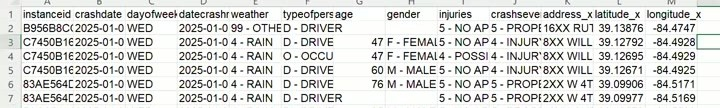

[Slides](https://fmegahed.github.io/isa401/fall2026/class01/01_introduction.html) | [PDF](index.pdf)

The recording is on Canvas, available to ISA 401 instructors. Timestamps before each paragraph are hh:mm:ss into the recording; drag the player there to hear the passage.

## Timeline

| Start | End | Min | What was happening |
|:--|:--|--:|:--|
| 00:00:00 | 00:04:09 | 4 | Welcome; the three phases of the course and the final project |
| 00:04:09 | 00:07:14 | 3 | Recording and Zoom screen-share policy, AI policy, Canvas modules |
| 00:07:14 | 00:09:25 | 2 | Office hours and the 15-minute booking link |
| 00:09:25 | 00:12:31 | 3 | HTML slides; goals for the day; fresh versus tidy data sources |
| 00:12:31 | 00:15:48 | 3 | ChatISA tour: modules, Job Scout, the word of caution |
| 00:15:48 | 00:21:37 | 6 | Activity 1, Claude Opus 5 against GPT-5.6 Sol; Mentimeter poll; Notes panel |
| 00:21:37 | 00:28:51 | 7 | Activity 2 set up; pair work on the Cincinnati crash extract |
| 00:28:51 | 00:38:33 | 10 | Crash debrief: unit of analysis, counts versus rates |
| 00:38:33 | 00:44:46 | 6 | The four stages of the analytics journey, run on the crash data |
| 00:44:46 | 00:47:42 | 3 | Mapping the ISA curriculum onto the four stages |
| 00:47:42 | 00:50:03 | 2 | What business intelligence is; the BI process diagram |
| 00:50:03 | 00:55:26 | 5 | Job Market Explorer introduced; Activity 3 set up; Job Scout profile walkthrough |
| 00:55:26 | 00:59:56 | 5 | Standalone dashboard link; Mentimeter link trouble; questions from the room |
| 00:59:56 | 01:02:32 | 3 | Debrief of the dashboard responses; stated limitations |
| 01:02:32 | 01:11:48 | 9 | One job ad in three shapes; merging sources; the BI value chain |
| 01:11:48 | 01:16:03 | 4 | What data visualization is; its goals; the 1854 cholera map |
| 01:16:03 | 01:19:04 | 3 | Activity 4, critiquing the dashboard's Top Skills chart |
| 01:19:04 | 01:20:41 | 2 | Recap slide and closing remarks on pacing |

The durations sum to 80 minutes against a recording of 80 minutes 41 seconds, the difference being rounding. The deck's own order was followed straight through, and the departure came only at the end, where the last critique activity and the three closing slides were dropped for time.

## Where students struggled

[00:25:31]{.ts} The first snag was mechanical. The crash CSV downloaded from Canvas does not open in Excel by default; on the machine on screen it landed in another application instead, and Fadel flagged it as something students would hit on their own laptops too. The fix he gave was to right-click, use Open With, and take it into Excel, which is where it was for the rest of the debrief. He said he would eventually set Excel as the default application on his own machine but was leaving it alone for now so that the other section would see the same behavior.
<!-- todo: awaiting answer #8 @ 00:25:31 - the default application is transcribed as "mini caps"; the desktop on screen is Windows and the file ends up in Excel, so my best reading is Minitab. Name it once confirmed. -->

[00:28:51]{.ts} The second was silence. About six minutes into the paired activity Fadel noted that the typing had died down and that pairs were not talking much to each other, put it down to its being the first class, and said that if nobody volunteered he would start calling names. He then went question by question, picking a side of the room each time. The count of variables came back as 13, one per column, and the date range as January 1 2025 to December 31 2025, the full year the extract was said to cover; there was a crash on the first day of the year and one on the last, so both endpoints are real.

[00:29:50]{.ts} The crash count is where the room went wrong, and going wrong there is the point of the exercise. A student answered 14,962. Fadel asked how the number had been arrived at, said he did not have the exact figure in his head, and went straight past the arithmetic to the cause: every row of this dataset is not a crash.

[00:30:55]{.ts} The term he wanted written down, and will use all semester, is the unit of analysis: in plain English, what does one row mean, and is that what you want? He scrolled into the file, enlarged it, and showed three consecutive rows sharing the same `instanceid` and the same crash date, with only the person columns changing.

[00:31:47]{.ts} Reading those rows aloud, he made it a two-car crash: one car with a driver and an occupant, the other with a single driver, and injury severity reported for each of the three people involved, a 47-year-old female driver, a female occupant of the same age riding with her, and a 60-year-old male driver. So the unit of analysis is a person involved in a crash, and counting crashes, whether in Power BI, R, Python or Excel, means counting unique `instanceid` values.

[00:33:05]{.ts} Fadel then said the day-of-week question had been asked loosely, which is worth knowing before setting it again. If the question is about crashes, the data should first be reduced to one row per `instanceid`, keeping roughly the first few columns, and then the days counted. As best he recalled the answer comes out the same either way, and that day is Friday.

[00:34:02]{.ts} The last question drew the answer it is designed to draw. A student offered that, statistically, more people get in accidents on a Friday than on any other day of the week. Fadel's reply was that this is technically not wrong, and that is exactly the trap: as a headline it leaves the reader with the wrong impression, and picked up by an agency it becomes "people drive badly on Fridays, take care."

[00:34:36]{.ts} He reframed it as a sharper question. Is it more dangerous to drive on a Friday than on another day, and how would you answer that if money were no object? The answer is rates rather than counts. You need a denominator: how many cars were on the road on Fridays, and what fraction of them were in a crash. His worked example was a million cars out on an average Friday against 500,000 on an average Monday, with Friday's crash count only 1.2 times Monday's rather than double, which leaves Monday the riskier day given that you are already driving.

[00:37:19]{.ts} He was careful not to turn that into a claim that Friday is safe. It cannot be assessed from this data, because the denominator is missing. Traffic studies do not usually use the number of cars either; they use vehicle miles travelled, because someone driving 100 miles has more exposure than someone driving one mile. Normalizing by miles driven gives the better model.

[00:38:03]{.ts} He closed the exercise by naming the two takeaways himself: know what the unit of analysis is, and when making a statement be precise enough not to imply something the data does not support. He called that the business-logic layer underneath all the mechanical work the course does, and the piece not to lose, and gave it as the reason the datasets in this course are real rather than canned.

## Questions from the room

[00:55:26]{.ts} A student asked where to find the dashboard outside the slide. Fadel opened the standalone full-page version from the link on the slide, the same dashboard with the whole browser window to work in, and confirmed everything in it is clickable: the skills chart, the Job Explorer tab, and the Behind the Data tab that shows how the postings were collected.

[00:58:06]{.ts} A student asked, mid-activity, how to get back to the page where completed courses are entered. The path Fadel retraced on screen was ChatISA, then Job Scout, then My Profile, then tick the courses and save. He stressed the save, because nothing persists without it, and showed that unticking a course removes it again.

## Demo notes and gotchas

### The opening ten minutes

[00:00:19]{.ts} Fadel opens on the premise that every company today is a data company and a technology company, and that the course is about turning data into decisions. He describes it as three courses in one. The first phase is getting, reading and understanding data from different sources, and is the most coding-oriented; he said the choice of language does not matter much, R or Python, but that historically this class has used R for that portion. The second is visualization, itself split in two: the mechanical side, about four different pieces of software so students leave with experience in more than one tool, and then the part he called the more important one, visualizing data the right way. That means how people perceive data, and making sure a reader does not take the wrong insight from a chart because of how it was presented. The last part, roughly two to four classes depending on the schedule, uses data mining not to predict but to organize, categorize and explore.

[00:02:49]{.ts} There is no final exam. The course ends with a group project, two or three people, covering everything the semester did: pulling data from different sources, integrating them, asking interesting questions of them, and answering them. Fadel described it as deliberately open-ended, the part students both hate and love, and he does not hand out a dataset. He set the bar for insight out loud: analyzing basketball data to conclude that LeBron James was one of the best players of the last decade does not clear it. Reaching a real insight usually means merging more than one data source.

<!-- todo: awaiting answer #1 @ 00:03:43 - "better than an OU student could give" and "that's not illegal" are both garbled; I paraphrased around them -->

[00:04:09]{.ts} Every class is recorded. Fadel expects students in the room and acknowledged that 8:30 on a Monday is hard, but records so that material can be revisited, or caught up after an interview or an illness; an absence does not have to be explained. For the coding sessions he asks students to log in to Zoom on their own machines, so that an error can be put on the shared screen and worked through by the class. His reasoning is that one person's error is rarely unique, and that the people who did not hit it still learn something for next time.

[00:04:58]{.ts} On AI, Fadel was direct about being unusual here. Use is not prohibited on any assignment or exam. On the second exam every question will be one that has been put to an AI model, with the model's answer supplied, and the student's job is to say whether it is right, wrong, or partly right, and if partly, which part. His framing was that students are paying a great deal for this education, so they should be the ones to tell him. The concern is not use but over-reliance: if you delegate your thinking and your agency to a tool, the question becomes why anyone should hire you.

[00:06:31]{.ts} Canvas is organized in modules by week, nothing fancier, and the course home page links straight to them. Week 1 is live; later weeks open as they are released. Recordings go up sometime around one o'clock after class, from one of the two sections, and in classes where code is typed the code file goes up too. There will not be a syllabus day, and Fadel apologized for that in advance.

[00:07:14]{.ts} Office hours are one to three on Mondays and Wednesdays. Fadel looked them up live on Canvas under Pages and thought they were probably in the course guide too. Rather than have students queue in the hallway, which he called a complete waste of their time, meetings are booked as 15-minute slots through the scheduling link, back-to-back if longer is needed. The point is that the 15 or 30 minutes belongs to one student rather than being split across four or five at once. Booking closes about two hours ahead, so a one o'clock meeting has to be booked by about eleven. If the week is full, email and it gets worked out. Fadel is in Oxford three days a week, so a Tuesday or Thursday will probably be offered as a Zoom unless the student would rather come to the office.

[00:09:25]{.ts} The slides are HTML rather than PDF, which he flagged as something students may not be used to. Ctrl-P and save as PDF works for anyone taking notes on a tablet. The HTML form is what lets the slides be interactive and walked through in class, and the decks themselves are written in R Markdown for anyone who wants to look at the back end.

[00:10:12]{.ts} Beyond the three formal objectives, Fadel stated a further goal for the day: to give students a feel for how the class runs and why it matters. Whatever they end up doing, they will be looking at dashboards, building dashboards, making visualizations, or interpreting them. His aside was that it is relevant even for fantasy football.

[00:10:59]{.ts} Alongside the analytics journey, the session also gave a 10,000-foot view of why the ISA curriculum is built the way it is. On data types, the point of departure is that courses like ISA 125, 225 and 345 mostly work with data that is already tidy, sitting in a database table or a CSV, ready to analyze. That is a common source but not the only one. A manufacturer like GE Aerospace also holds warranty complaints and maintenance reports from clients, and how those relate to process quality, and how to use them to improve production, is a real question. In marketing, a preliminary market analysis mixes numbers with text that has to be digested. Mapping those sources onto data types is part of the day.

<!-- todo: awaiting answer #2 @ 00:11:42 - transcript has "water complaints"; I wrote "warranty complaints" -->

### ChatISA and the model comparison

[00:12:31]{.ts} Slide 3 lays out ChatISA, the tool Fadel has developed and maintained since August 2023 for ISA students. He noted the slide was slightly behind: another module had been added the week before class. It is not ChatGPT and not Claude; it is access to 17 or 18 different large language models, some open-weight and some commercial, paid for through the department so that students are not paying twenty dollars for Claude, another twenty for ChatGPT and ten for GitHub Copilot. Students are free to pay for their own tools; this exists so they do not have to. Some assignments nudge them toward specific modules: an online portfolio to share with employers, or Job Scout for jobs that may not appear on Handshake. Fadel said he does not track who uses it.

[00:13:49]{.ts} The modules that come up during the semester are the Coding Tutor, the Coding Studio, and, today, Job Scout. Job Scout connects to two different APIs and pulls jobs, focused mainly on ISA-type roles. Double majors will not find much finance or supply chain, though some postings share keywords with analytics and IS jobs. From a posting, students can have AI tailor a resume or cover letter.

[00:14:26]{.ts} The word of caution at the bottom of Slide 3 got its own emphasis. AI tools give the right answer for 90 to 95% of applications. The problem is the other 5 or 10%, where the wrong answer still looks convincing. It usually does not come back as an error; it comes back as something plausible. That is why the student's own understanding has to be good: you do not have to be a software developer to do interesting things, you have to understand the business, but when the tool makes a wrong assumption you need to be able to spot it.

[00:15:34]{.ts} Slide 4, the executive overview of ChatISA carried over from HW0, went up on screen for a few seconds on the way past. The embedded video was not played.

[00:15:48]{.ts} The first activity, on Slide 5, is the head-to-head comparison. Students go to <https://chatisa.fsb.miamioh.edu> and sign in with their Miami account. The login is gated to `@miamioh.edu` accounts so that the API credits being paid for go to Miami students. Sessions do not carry across machines, which Fadel invited the room to test on a second computer; signing in on a laptop does not bring over what was done elsewhere.

[00:16:39]{.ts} From there, the **AI Comparison** module sits at the end of the module list. Two models are picked: Claude Opus 5, the second-highest Claude model available in ChatISA, and GPT-5.6 Sol, the highest OpenAI model available in ChatISA and the highest OpenAI offers publicly. Both get the same single question from the slide:

> I am taking a business intelligence (BI) course. Give me a short definition of business intelligence. Create a flowchart that captures this process.

[00:17:21]{.ts} The module supports two ways of comparing: blind, to find out whether a model you have not used before is one you like without knowing which it is, or against a model you already use as the baseline, to decide whether the twenty dollars a month is still worth it. Clicking Compare streams both answers in. In class the differences were in speed, in how each laid the answer out, and in how each rendered its flowchart. The flowcharts come back as Mermaid, so the block can be pasted into an online Mermaid renderer to see the diagram drawn.

[00:18:53]{.ts} The class then voted on the Class Poll tab, at menti.com with code 1781 1839, on which model's output they preferred. The result was close. The poll showed percentages only, 53% for Claude Opus 5 against 47% for OpenAI's GPT-5.6 Sol, and Fadel read that out loud as maybe 18 people, roughly nine to eight, and made the point that there is not a lot of difference in performance between the two. What does differ is cost: from Miami's point of view, one of the two is cheaper to run than Opus, which is worth knowing when choosing.

<!-- todo: 00:20:15 - Fadel says "this is a cheaper model to run than Opus" without naming which; I read it as GPT-5.6 Sol. Please confirm. -->

[00:21:01]{.ts} The Notes tab on that slide is an editable panel, and most activity slides have one. Students can type into it during class. It saves to the browser's local storage, so it persists between sessions on the same machine but does not follow anyone to a different computer. Fadel said Ctrl-R clears it, describing what is stored as not really cookies but close enough to think of that way.

<!-- todo: 00:21:23 - Fadel said Ctrl-R clears the saved notes, described as "kind of like cookies attached to this page". Worth confirming that's a reload-clears-it behavior and not a separate reset. -->

### The Cincinnati crash extract

[00:21:37]{.ts} Cincinnati publishes a lot of city data, including traffic crash reports. Fadel took an extract of the last full year available, 2025, and posted it on Canvas under the Week 1 module. Slide 7 links both the source page on the Cincinnati open data portal, which carries the metadata describing what each field is, and the Canvas download of the extract.

[00:22:16]{.ts} The activity as run: shake hands, fist bump or whatever, introduce yourself to the person next to you, and work through the slide's four questions together. How many crashes are in the dataset, how many variables, what dates it covers, and which day of the week appears most and what that means from a driving-safety perspective. Eight minutes on the clock, framed as roughly six to work and two to discuss. Method deliberately left open, Excel, R, ChatISA, anything, with the answer typed into the Your Solution panel on the slide.

[00:23:11]{.ts} Fadel explained on the fly why the slide carries two links. The first goes to the source page and its metadata, so students can see what they are actually looking at; the second is the direct Canvas download. If the download link does not fetch the file, the Week 1 module has it.

### Walking the analytics journey on the crash data

[00:38:36]{.ts} Fadel frames the analytics journey in four steps. The first, which he casually calls pre-analytics, is the process of getting data; in industry it is often the data engineering job. It means pulling from multiple sources and putting the result in a shape people can consume. Slide 8 makes the same point through the contrast between canned data, the `iris` and `mtcars` of the world, stale but convenient, and fresh data from places like the Cincinnati or Ohio open data portals, interesting and messy. Real data brings real problems: the unit of analysis is not the assumed one, so it needs preprocessing; the data is not clean, so it needs cleaning.

[00:39:37]{.ts} Slide 9 shows the counts once the data is reduced to unique crashes. By day of week, Friday is highest at 2,380, though not by much against Wednesday at 2,327 and Thursday at 2,285, with Monday at 2,020 and Tuesday at 2,241; Saturday at 1,866 and Sunday at 1,664 are the light days. Fadel contrasted this with the counts on the full person-level data, where the Friday total is several thousand higher.

<!-- todo: 00:39:37 - Fadel says the Friday count on the un-deduplicated data was "close to 5,400... 4,900 and something"; ASR is unclear on which. I left the figure out. -->

[00:40:06]{.ts} The weather table on the same slide makes the denominator point a second time and more cleanly, and it is the cleaner of the two examples to lean on. Clear weather accounts for far more crashes than any other condition, 10,437 of them, against 1,991 cloudy, 1,661 rain, 476 snow, and single digits for freezing rain and severe crosswinds. Sleet or freezing rain is probably more dangerous to drive in, and more slippery. It produces almost no crashes because almost nobody is out in it. Same lesson: the count reports exposure, not risk.

[00:40:36]{.ts} Descriptive analytics is where this course lives. It is the same statistical summarizing done in ISA 225, plus the ability to carry that summary in a visual language instead. Slide 10 is a bar chart of the same day-of-week counts. Could it have been a different chart? Yes. Fadel also made a deliberate decision not to sort the bars in descending order by count, because in this case a reader reads Monday, Tuesday, Wednesday more naturally and can compare up and down the list from there. His claim was not that this is the perfect choice, but that it should be a choice: not something kept because Tableau or Power BI handed it over that way, or because ChatGPT or Gemini returned that chart. It can be asked to change.

[00:41:52]{.ts} Slide 11 puts the whole year on a calendar, one cell per day, darker for more crashes. The weekday pattern from the bar chart shows up again as visibly lighter Saturday and Sunday columns. Fadel also picked out a cluster in late October, around Halloween, with more people involved in crashes, and said plainly that he did not know why. The daily range runs from the lightest days, which he put at fewer than 15 or 20 crashes, up to about 90 on the darkest; the legend on the slide is labelled 30, 50, 70, 90, so the lightest cells sit below its lowest tick.

[00:42:57]{.ts} The third step is predictive analytics, which asks what will happen. Do the patterns from 2023, 2024 and 2025 carry into 2026? The curriculum answers that with statistical models, machine learning models, and forecasting models. The caveat Fadel attached was junk in, junk out: everything done in the data management and exploration stages, making sure the data is right, making sure inferences are not being drawn about people involved in crashes when the question was about crashes, propagates forward into the model.

[00:43:46]{.ts} The fourth step is prescriptive analytics, which asks what should be done about it. For the Cincinnati Police Department that means more traffic stops, more enforcement of the speed limits, more checks for impaired driving. Resources are limited, so the same effort does not go everywhere: perhaps four patrol cars on a Monday and five on a Friday. The point is turning the model into an allocation that reduces the chance of a crash.

<!-- todo: awaiting answer #4 @ 00:44:07 - transcript has "potential thefts of wrong driving"; I wrote "checks for impaired driving" -->

### Where the ISA curriculum fits

[00:44:46]{.ts} Slide 13 is Fadel's own mapping of the ISA courses onto those four stages, and he walked it course by course. **ISA 345** is the main data management course, covering databases, database design, schema types, and extracting information from them; it is a prerequisite for this class. **ISA 401 and ISA 414** both spend time getting data out of other sources, APIs and web scraping, but for different ends: 414 goes on to analyze that text with natural language processing, while here the goal is getting data into a form that can be handed to a dashboard, and building a dataset of one's own. On the descriptive side, **ISA 225** is the statistical treatment and **ISA 401** is the visualization one, including interactive visualizations and dashboards. **ISA 391** uses statistics to explain what happened in the past. **ISA 491** is the machine learning and data mining course, the one that answers a question like: given a Friday in the mid-70s with the Reds in town and nice weather, how many crashes should I expect? **ISA 444** is the trends-over-time course, where time itself is part of the fit; Fadel's made-up example, flagged as made up, was Cincinnati's population rising 15% over a decade and whether crashes rose proportionally. On the prescriptive side, **ISA 321** is mathematical modeling and optimization, allocating a limited budget across choices there are predictions for, whether stocks or a fantasy football roster. **ISA 365** is experimental design, the course that answers whether changing the color of Amazon's purchase button actually did anything, through A/B testing.

### Business intelligence, from data to decisions

[00:47:43]{.ts} Business intelligence and data visualization are the two terms in the course name. Fadel's working definition of the first is the process of going from data, to information, to knowledge, to decisions. Slide 15 gives the textbook version, from Sharda, Delen and Turban: interactive access to data, sometimes in real time, the ability to manipulate it and run appropriate analysis, and the transformation of data into information, then decisions, then actions. The image on that slide is a stock market prediction tool built with Bin Weng.

[00:48:41]{.ts} Slide 16 is the process diagram, and Fadel's gloss was that it should not be pictured as one person at a computer. There are data sources that need organizing and a standardized way of capturing them. That goes into a database or a data warehouse. On top of the warehouse sit interfaces, dashboards in Power BI or whatever tool is preferred, so that managers and decision makers can generate insights without writing code. Those dashboards can be retrospective, aggregating last month or last quarter, or they can be real-time.

[00:49:35]{.ts} Which one gets built depends on the decision being supported. Data for a staffing or configuration decision looks quite different from data for a strategic choice about where to put the next warehouse. The aggregation is different and the unit of analysis is different. That is the thing to stay aware of.

### The Job Market Explorer and Job Scout

[00:50:05]{.ts} Slide 17 embeds a dashboard Fadel built from the Job Scout side of ChatISA. Job Scout harvests new postings every Sunday; this extract is the one from the Sunday before the previous one, retrieved August 16 2026 per the slide's footnote, and holds 1,437 postings from the ActiveJobs and USAJobs APIs. Moving the cursor over the dashboard reads out the counts. Because postings expire, there is a posting-status filter, and with it set to Still Active the dashboard shows 781 of the 1,437.

<!-- todo: awaiting answer #6 @ 00:50:13 - transcript says "the Sunday the 4th"; the slide footnote says retrieved August 16, 2026 -->

[00:50:55]{.ts} The activity on Slide 18 gives a few minutes to explore the dashboard, starting in the Job Explorer tab, finding one posting worth actually applying to, internships counting, and then answering two Mentimeter questions: one question the dashboard should answer to help with a career decision, and one question to ask about the data itself before trusting the answer. Fadel thought the full dashboard had also been posted to Canvas but was not certain; the standalone full-page version is linked from the slide either way.

[00:51:36]{.ts} The framing is the same one the crash data got. Having data does not mean everything can be done with it, and noticing where it runs out is what says which other source has to be brought in.

[00:52:12]{.ts} Alongside the dashboard, Fadel walked through building a profile in Job Scout itself. Ticking the ISA courses taken or in progress, grouped by level, fills the skills panel on the right as it goes: each skill marked Strong or Working, with the courses it came from listed. His assumption for a 400-level class is ISA 125, 225 and probably 345, with 391 less certain. Then save. Nothing sticks without saving, and twice on screen Fadel said aloud that he was not sure whether his own selection had saved, so the save state is worth watching when demonstrating this.

[00:53:09]{.ts} With courses saved, a list of matching jobs appears. Fadel was frank that the ordering is not good yet: postings matching more skills can end up below ones matching fewer. Full-time and internships can be filtered apart. The postings are real, so clicking one goes to the actual ad, and some have already expired and come back as no longer available. He noted that a still-available filter would be a sensible thing to add.

<!-- todo: 00:54:01 - Fadel says "maybe eventually I should put a filter here, whether it's still available or not". Flagging in case that ships before the next offering. -->

[00:56:19]{.ts} The one place the demo stalled was the second Mentimeter poll. Having just shown the standalone dashboard, Fadel could not get the poll on the slide to do what he wanted, said he might not have completed the link, and opened the Mentimeter presentation directly in its own tab to check it was live. He also asked the room whether a Ctrl-R reload changed the question in front of them, and got a hedged answer. It cost roughly two minutes.

<!-- todo: 00:56:19 to 00:58:06 - the recovery here is only partly recoverable from the transcript; the frame at 00:57:40 shows the raw Mentimeter presentation URL open in its own tab. Worth a listen to confirm what exactly was broken in the slide embed, so the fix can be made before the next offering. -->

[00:58:50]{.ts} Skills can also be added by hand rather than only inherited from courses. Fadel's example was marking a strong foundation in probability. Communication in particular is not captured explicitly from any course, but as FSB students they have done a lot of presentations and some technical writing, and as Miami students at a liberal-arts-style school, problem solving and communication are probably already strengths. He told them to put those in themselves.

### What the room asked of the dashboard

[00:59:56]{.ts} The responses that came back clustered on two things: expected salary for a position, and how to close a gap when a posting wants a skill the student does not have. On the second, Fadel said he already has an idea, since each course has skills attached to it: the tool could run that mapping backwards and name the two courses that would build a given skill, machine learning or AI for instance. On salary, that is genuinely not in the data, and the rest of the class was built on that gap.

[01:00:31]{.ts} Fadel was explicit that the answers were all fine and that he was not complaining about them, but pointed at a different thing the visualization supports. Because the harvest was aimed at ISA-type jobs, this is not the whole market. He also tried to filter to postings asking for zero to two years of experience as a proxy for entry level, and said plainly it does not work consistently, because the underlying text is unstructured and does not say it the same way twice. What the dashboard is good for is whether a student's skills are usable, what to improve, and how that informs which classes to take next, with one semester left or three.

[01:01:54]{.ts} The limitations, stated as such: there is not much salary information, and the skills were extracted by an AI model, so they are imperfect and would need cleaning. With that said, moving from the whole job market to some insight about the job market has utility.

[01:02:40]{.ts} He then gave the reason for spending class time on it. Charts from the news will come in during the semester, and he said the politics behind them are not the point. An ISA student, minor or major, should be able to look at a visualization and say whether the data behind it supports the conclusion being drawn; when someone puts a chart up in a board meeting or a technical meeting, that is the job in the room. He called it a hard skill, not one read out of a textbook, which is why examples keep arriving. Exam 2 is exactly this exercise on AI outputs: he will supply the recording of the prompting so the class can see nothing strange was done, then ask how the models interpreted the data.

### One job ad, three shapes

[01:03:51]{.ts} The last big idea of the day uses a single posting to show the three data types. Slide 19 is the job ad as a human, or Job Scout, actually reads it: Research Data Scientist on the Magic Eye team at Google, Mountain View, posted 2026-08-12. It wants a master's in a quantitative field and three years of experience, which Fadel noted puts it outside the entry-level window he was aiming for, though an MSBA student might be qualified. The ad has a salary range in it, and responsibilities, and a description of the team. That is a lot of information, but it is unstructured: free text, no fixed fields, and none of it readily consumable. As the slide's footnote puts it, the salary is right there in the text and no filter or chart can reach it until someone or some model extracts it.

[01:05:07]{.ts} Slide 20 is the same posting after Job Scout's model has read it: a JSON list of skills, each one a `skillId` with an `importance` of required or preferred. Fadel called this semi-structured, and gave the reason: `skillId` repeats. It cannot be dropped straight into a CSV table, because the repeats have to be handled. Comma-separate them into one cell? Repeat the job ID and make the data long? Those decisions are what stand between this shape and a data table. This ad carries 12 skills; another might carry 4, which is exactly what makes the shape flexible. JSON, JavaScript Object Notation, is what a great many APIs return, and parsing it is a few weeks out.

[01:06:23]{.ts} Slide 21 is the structured version: one row in the `scout_postings` table, with `source`, `title`, `company`, `location_city` and `location_state`, `posted_at`, `category`, and so on, the same fields for every posting. For the skills, Fadel said what he himself would do is key them by the posting ID and repeat that ID once per skill, making a long table. That shape supports counting how many skills a job asks for, and asking how many jobs require problem solving. It is the easiest way to consume that information. Worth noticing on this slide: there is no salary column. It did not survive the trip.

[01:07:25]{.ts} Slide 22 puts the three side by side. Unstructured is the job ad, and it does not have to be text; it can be audio or video. It is reached with text mining, or with an LLM, or with regular expressions, which is what ISA 414 teaches. Semi-structured is the JSON, which is what APIs hand back, and it is also the format to request from an LLM when using one to extract information, precisely because it is more structured than free text. Structured is the database row, worked with in spreadsheets, SQL, or R data frames. Much of this course is about moving data from left to right.

[01:08:22]{.ts} Slide 23 is why one source is rarely enough, and Fadel started it from the salary question the room had raised. Suppose Google will pay $200,000 in San Francisco for a role wanting a master's and three to five years. That is all good, but it means something only next to comparison data. If similar jobs with the same qualifications in that area pay $160,000, the $200,000 is very good. If the average is $200,000, it is just the going rate. So the move is to supplement with something like BLS wage data, or levels.fyi for tech salaries, and check consistency with what other companies pay in that location. Salary depends on location, on experience, and on field, and that context is what would let these postings actually be assessed.

<!-- todo: awaiting answer #5 @ 01:09:06 - transcript has "levers.io"; I wrote levels.fyi -->

[01:10:07]{.ts} Slide 24 is the value chain in four rows: what happened, which is raw facts; what does it mean, which is context; why did it happen, which is patterns; and what should we do, which is action. Fadel ran the job data through it, and flagged the numbers as real rather than invented. Roughly 1,400 postings, of which maybe 700 or 800 were active. SQL was tagged in 31%. Communication appeared in 79%.

[01:10:44]{.ts} The decision that follows: because these are ISA-type jobs, there is an expectation of business relevance alongside the technical work. So learn to code, build on what ISA 345 started, extend it in 401 or 381. And at the same time do not forget that an ISA graduate is not a developer; the value added is being able to explain what these things mean so the business can make better decisions. That is the move from 1,400 raw postings, to a summary of what they say, to a decision about how the rest of a degree gets spent.

### Data visualization, the cholera map, and the Top Skills critique

[01:11:49]{.ts} With about nine minutes left, Fadel gave the short definition: data visualization is the process of presenting data in some graphical format.

[01:12:03]{.ts} Slide 26 carries an animation of Cedric Scherer's ggplot, where a single dataset is redrawn again and again. The point Fadel drew from it is that this iteration has become very cheap now that LLMs can both search and write the plotting code, so there is no excuse for settling. Do not stop at "I made this chart because I know how to do a boxplot in this software." Ask whether it is the right level of detail and what is missing, and use AI to push the visualization further. That part, he said, is on the student, and being meticulous is what makes a chart show the data better.

[01:12:58]{.ts} Slide 27 lists the goals. Recording information, which sometimes means a table, and Fadel noted that visualizations and tables can be combined. Analyzing data. Communicating it to other people. And interacting with it, which is what a dashboard adds, because the reader can ask their own question. His example was going to the Job Market Explorer and asking how many jobs requiring data visualization sit in the Midwest, picking Ohio, Illinois, Michigan and Indiana, and getting back the counts and the skills for exactly that slice.

[01:13:56]{.ts} Slide 28 is the classic example, and Fadel pulled two separate lessons out of it. The first is the story. This is one of the first maps built for the purpose of data analysis, made in the 1800s in London by a physician named John Snow, who plotted where the people who died of cholera lived; he compared the move to what crime shows do. What Snow noticed was a clustering of deaths around the Broad Street intersection, and when he went to that area there was a well. The prevailing hypothesis at the time was that cholera came from the air. Snow's hypothesis from the map was that it was waterborne. They shut the well down, the numbers came down, and later analysis confirmed that dirty water causes cholera. That is storytelling driving a decision.

<!-- todo: awaiting answer #3 @ 01:13:56 - the street name and "cholera deaths" are badly garbled in the transcript; I wrote Broad Street from the standard account. Please confirm that is what was said. -->

[01:15:10]{.ts} The second lesson is a term that will run through the semester: data encoding, meaning how the data gets turned into marks on a chart. On this map, as on any map, the encoding is x and y position, the coordinates carrying where each person lived, and each person represented as a circle. That is the whole encoding, and the slide's note adds that position is perceived more accurately than other encoding channels.

[01:16:04]{.ts} Slide 29 turns the same questions on a chart from the course's own dashboard, the interactive Top Skills bar chart. Fadel said at the outset that there was not a lot of time for it and that he would go quickly. The data represented is a categorical variable, the skill name, and a count; arguably three variables rather than two, because the count is split, the dark red segment being the number of postings where the skill was required and the lighter pink the number where it was preferred. Added together they give the total for that skill. For communication that total is 1,130, out of the 1,437 postings, though Fadel hedged on the exact figure aloud. So the underlying table has one row per skill, with a required count and a preferred count.

[01:17:25]{.ts} The encoding, then: the length of the bar carries the total number of jobs asking for that skill, and position on the y-axis carries rank, so communication is at the top, then problem solving at 902, then data analysis at 741. Whether that encoding is effective he deliberately left with the room. Two concrete directions were offered: use color to group technical skills against softer or communication skills rather than spending it on required against preferred, and print the required-versus-preferred split, since the bars already carry the total but the split cannot be read off.

[01:18:53]{.ts} Slide 30 is a chart taken from the wild, a Heritage Foundation infographic headlined "What If a Typical Family Spent Money Like the Federal Government?", with the same three questions attached. Fadel stopped rather than rush it and set it as preparation for the next class.

[01:19:04]{.ts} He did clarify the wording of those questions before letting them go. When the slide asks what data is represented, the plain-English question is: if this were an Excel file, what would the columns be? Then, how is each of those columns visually encoded? Then, is that encoding effective, which is where the next class picks up.

[01:19:25]{.ts} Slide 32 restates the three objectives, and Fadel named the skills practiced underneath them along the way: finding the unit of analysis, telling counts apart from rates, questioning where data came from, and reading a chart's encodings.

The three slides after that were not reached, and nothing on them was said aloud: the review-and-clarification page, the optional prep for next class (the Introduction and Workflow Basics chapters of *R for Data Science*, plus a gentle introduction to LLMs, none of it required), and Assignment 01 on Canvas, which is.

## For next time

[01:19:55]{.ts} Fadel closed on pacing, prompted by something he had noticed during class. He asked the room to tell him if he was going too fast, said his expectation is that students show up and understand the material, and that he does not care whether two slides get covered or all thirty. He added that this only works if people speak up.

[01:16:04]{.ts} He said aloud that there was not much time left for the Top Skills critique and that he would go through it quickly, and then, one slide later, chose to stop rather than rush the last activity and handed it over as preparation.

[00:33:05]{.ts} On the crash activity, he said he had been vague in the way he asked the day-of-week question.

[00:53:09]{.ts} On Job Scout, he said the ranking of matched jobs is not good yet, since a posting matching more skills can sit below one matching fewer, and floated adding a filter for whether a posting is still available.

[01:00:11]{.ts} He also said he has an idea for the skill-gap question the room raised: since each course carries a set of skills, the tool could run that mapping backwards and name the courses that would build a given skill.

[00:25:54]{.ts} He said he would eventually set Excel as the default application for CSV files on his machine, but was leaving it alone for now so that the other section would see the same behavior.

Suggestion: budget for the overrun. The crash debrief ran about ten minutes against the eight-minute countdown on the slide, and the deck's last activity is what paid for it. Either cut the four questions to three or plan from the start for the chart-in-the-wild critique to open the following class.

Suggestion: test both Mentimeter embeds from the deck before class. The first poll ran cleanly off the slide; the second cost about two minutes and ended with the presentation opened in its own tab.

Suggestion: decide in advance what crash count the room should leave with. Fadel would not commit to a figure, so a student's number is the only one said aloud, while the per-day counts on Slide 9 give a checkable total.

Suggestion: consider leading the counts-versus-rates point with the weather table rather than the day-of-week one. Nobody in the room will argue that sleet is safe, so the missing denominator lands faster there.

Suggestion: if the ChatISA overview video on Slide 4 is not going to be played, either drop it from the live pass or give it the twenty seconds it needs; it was on screen for a few seconds and skipped.

Open: whether the two garbled phrases in the project brief at 00:03:43 are transcription errors, and what was actually said.

Open: whether the GE Aerospace example at 00:11:42 was warranty complaints or something else.

Open: which of the two compared models is the one described at 00:20:15 as cheaper to run than Opus.

Open: which application the downloaded CSV opened in by default at 00:25:31; the audio reads as Minitab and the desktop on screen is Windows.

Open: the crash count to teach: 14,962 as answered in the room, against the 14,783 that Slide 9's per-day counts sum to.

Open: the Friday total on the person-level data, spoken at 00:39:37 as either about 5,400 or 4,900-something.

Open: what the prescriptive-analytics example at 00:44:07 actually was; the note reads it as checks for impaired driving.

Open: the harvest date for the job extract, spoken as the Sunday the 4th against the slide's August 16 2026.

Open: whether the full dashboard was posted to Canvas, which Fadel was unsure of on the day.

Open: what exactly failed in the second Mentimeter embed between 00:56:19 and 00:58:06.

Open: the salary site named at 01:09:06, read here as levels.fyi.

Open: the street name in the John Snow account at 01:13:56, read here as Broad Street.

Open: whether Ctrl-R clears the editable Notes panels, as stated at 00:21:23, or whether a separate reset is involved.

Open: the Heritage Foundation chart critique deferred at 01:18:53, which needs carrying into the class 02 notes.

<!-- todo: awaiting answer #1 @ 00:03:43 - "better than an OU student could give" / "that's not illegal" both look like ASR errors; I paraphrased around them -->
<!-- todo: awaiting answer #2 @ 00:11:42 - "water complaints" -> "warranty complaints"? -->
<!-- todo: awaiting answer #3 @ 01:13:56 - John Snow street name garbled; I wrote Broad Street -->
<!-- todo: awaiting answer #4 @ 00:44:07 - "potential thefts of wrong driving" -> "checks for impaired driving"? -->
<!-- todo: awaiting answer #5 @ 01:09:06 - "levers.io" -> levels.fyi? -->
<!-- todo: awaiting answer #6 @ 00:50:13 - "the Sunday the 4th" vs the slide's "Retrieved August 16, 2026" -->
<!-- todo: awaiting answer #8 @ 00:25:31 - CSV default application transcribed as "mini caps"; best reading is Minitab (screen shows Windows, file then opened in Excel) -->
<!-- todo: 00:20:15 - Fadel says one of the two models is "cheaper to run than Opus" without naming it; I read it as GPT-5.6 Sol. Confirm. -->
<!-- todo: 00:29:50 - a student answered 14,962 crashes; Slide 9's per-day counts sum to 14,783 unique crashes with a non-missing date. Worth saying which number you want students to take away. -->
<!-- todo: 00:39:37 - the Friday count on the un-deduplicated person-level data is spoken as "close to 5,400... 4,900 and something"; I omitted the figure -->
<!-- todo: 00:51:11 - Fadel was unsure whether the full dashboard was posted to Canvas; please confirm so this can be stated plainly -->
<!-- todo: 00:54:01 - a still-available filter for Job Scout was floated as a future addition -->
<!-- todo: 00:56:19 to 00:58:06 - a couple of minutes of the recording are Fadel fixing a Mentimeter link; nothing in the transcript is recoverable there. Confirm nothing of substance was said. -->
<!-- todo: 01:18:53 - Slide 30 (the Heritage Foundation chart) was deferred to next class; carry the critique forward into the class 02 notes -->

## Materials

- [Slides](https://fmegahed.github.io/isa401/fall2026/class01/01_introduction.html)
- The recording is on Canvas, available to ISA 401 instructors.
