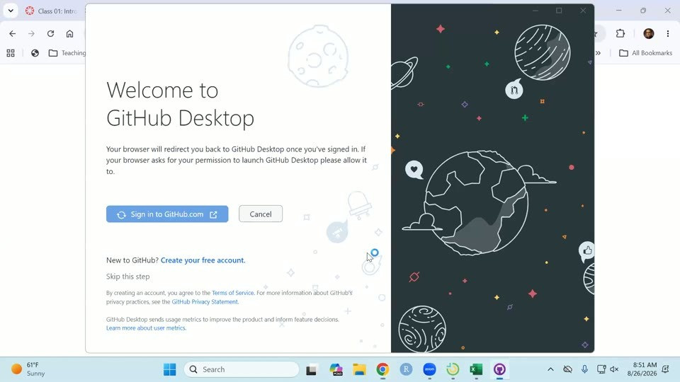
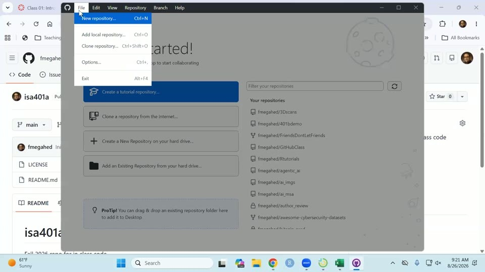
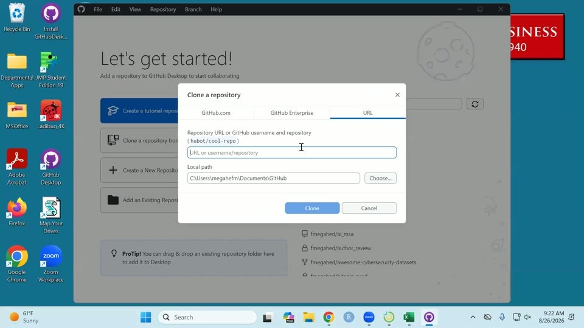

[Slides](https://fmegahed.github.io/isa401/fall2026/class02/02_git_foundations.html) | [PDF](index.pdf)

The recording is on Canvas. Timestamps before each paragraph are hh:mm:ss into the recording; drag the player there to hear the passage.


## What we covered

The first third of the session finished the Class 01 deck: the analytics journey, the three shapes of data, unit of analysis, and visual encoding, including a live Excel detour into why 3D bar charts mislead. The rest was setup and Git. Everyone installed GitHub Desktop, signed in, and configured Git, and then we cloned a repository, edited a file, committed, pushed, pulled, and reverted. We finished by generating a career portfolio site with the ChatISA portfolio builder, which is the starting point for Assignment 02.

Today's objectives, from the deck:

- **Explain** why scripted languages enable **reproducible analysis**.
- **Initialize and use Git** for version control.

## Finishing the Class 01 deck

[00:00:06]{.ts} We picked up where Class 01 stopped. The plan for the day: go back and close out the previous deck, then move to the basics of scripting in R and to Git and GitHub.

[00:00:54]{.ts} The recap started with the analytics journey and its four steps. **Pre-analytics** is where you get data from different sources, internal or external to the organization, and put it either into a database or into some local storage you can then access and analyze. **Descriptive** analytics is where you try to understand patterns in the data, and you go about it by plotting and by computing mathematical summaries; the two complement each other. **Predictive** modeling, which we do not do in this class, tells you what would happen in the future through statistical modeling or machine learning. **Prescriptive** modeling comes after: if you have a model that predicts, with some reasonable error, how stocks will behave over the next year, you still need to know how to invest your money and manage your portfolio, and that is what prescriptive modeling lets you decide.

[00:02:48]{.ts} Then the three shapes of data, using the ISA Job Scout data that had about 1,400 jobs in it at the time. To do business intelligence well, in many cases you want your end product to be structured data that you can visualize in Tableau or Power BI. Looking at one job ad, the blurb is **unstructured**: the responsibilities are listed in bullet points, the salary range might or might not be there, the location might or might not be explicit. Think of it as something you would have in a Google Doc, just a wall of text. When you pull that text programmatically, and especially when you connect to an API, you typically get it back as **semi-structured** data: JSON or XML. If a job lists a skill ten times, you then have to make a deliberate decision about how to encode it back into your database. Do you want a long data set with a job ID and a skill, so that ten skills means ten rows? Do you want it wide? Do you want to separate the skills with a comma? That is what semi-structured means: there is some structure in it, but there is still keying to be done before it goes into a CSV file or a database. Once you have a data table in a database, or data laid out properly in an Excel file, that is **structured**.

[00:05:39]{.ts} The crash data set was the example for unit of analysis: what does a row of data mean? There a row corresponded to a person involved in a crash, which is not necessarily the level you want to analyze at. Usually you would roll it up to the crash and ask how many crashes happened in a given day or a given week. For those of you who have had ISA 345, this is the same idea as asking what the key is for that data set; here it is the instance ID.

[00:06:31]{.ts} A navigation tip for the slides: pressing `O` gives you an overview of the whole deck.

### Encoding

[00:06:57]{.ts} Encoding is a fancy way of asking how we take the values in a data set and represent them in a chart. On the cholera slide, showing deaths in London in the 1850s, the unit of analysis is a person who died. If you imagine that data in an Excel file you would probably say two or three variables: something identifying the person, maybe a name, maybe an identifier, maybe just a record number, and then the latitude and longitude of the house. The map uses those coordinates as the x and y position to plot each house, and each person is drawn as a circle. On a map you are always using x and y position to capture the thing you are interested in, whether that is a county's boundary lines, a country, or, as here, a symbol for a person who lived at that address.

[00:09:03]{.ts} The Top Skills chart from the dashboard got the same treatment. The total length of the bar is the sum of the required and preferred counts for that skill. The y-axis position captures the skill, and note that it is not alphabetical: it is in descending order of the total number of jobs that listed the skill either as required or as preferred. In Excel that data set would be three columns: the skill, the count of jobs that listed it as preferred, and the count of jobs that listed it as required, and the visualization software adds them to get the full bar. Color is a third encoding channel here, splitting the two kinds: dark red for required, the lighter red for preferred.

[00:11:07]{.ts} The last Class 01 example was the "What If a Typical Family Spent Money Like the Federal Government?" infographic. Asked what data is in it, the answer is a categorical variable for the category of government spending and a numeric variable for the dollar amount being spent or owed. Fadel noted that data in this course will come from many places, sometimes from popular media, and that there is no political agenda behind it.

[00:11:59]{.ts} There are, however, two data-visualization agendas that are not hidden: do not make 3D charts, and do not make pie charts. The infographic is the example for the first. Its encodings are the x-axis position for the categorical spending variable, with median income first, then the government's equivalent figure, and so on across the chart, and the height of the stack of $100 bills for the numeric variable.

<!-- todo: awaiting answer #1 @ 00:11:59 - the second "agenda" is garbled in the transcript ("is find this"); I wrote "pie charts". Please confirm. -->

[00:13:11]{.ts} The chart was praised before it was criticized. It is memorable: you would still recall it six weeks later. It does a genuinely good job of explaining government debt to a layperson, with no business class required. "I don't really understand trillions of dollars. My brain doesn't really capture that." Rescaled to an average family, it says the government spends about 20% more than it makes every year, which is the difference going onto a credit card, and carries a debt several times its annual income. As data storytelling, an amazing job.

[00:14:48]{.ts} The trade-off got a live demonstration in Excel. In a blank workbook we typed four categories with the values 10, 4, 8, 16, and inserted a 3D bar chart. The perspective in a 3D bar chart is always the same: the 10 clearly appears to be less than 10, the 4 less than 4, the 8 less than 8, and the 16 less than 16. The purpose of making a chart is to let people get insights quicker, so a chart that systematically reads low is a deceptive chart. Then the same data, in the same software, as a plain 2D bar chart: much clearer. Nothing about the software changed.

[00:16:20]{.ts} Back on the infographic, the same distortion is at work. If the numbers were not printed on it and you were asked how much larger the tall stack is than the short one, most of the room would guess ten times or more. The reason is what you can actually see. On the tall stack you clearly see the front, the sides, and a little of the top, three dimensions. On the short stacks you get much less of that, so you read only two. Your perception is skewed by how many faces of the stack you were shown, and that is not data.

[00:17:32]{.ts} The Class 01 recap slide closed the loop on terminology. **Unit of analysis:** in the crash data, the rows did not correspond to crashes. **Counts versus rates:** we do not know the denominator, so we cannot say anything about safety, and you always need to think about how the data was generated. **Visual encoding:** literally how each variable in your data set is represented in the chart. You will also hear the phrase *encoding channel*: the x position, the y position, the length of a bar, the height of a bar, color. Those are the channels we use to represent a variable on a 2D screen.

## Before we start: Zoom and GitHub Desktop

[00:19:01]{.ts} Since this was only the second time on the lab computers, the opening slide set two tasks (or four, depending on how you count). Zoom is installed on the lab machines but not connected to your account, and there is now a Zoom link for the class in the Week 0 module on Canvas. Log in to Zoom from the lab machine so that when you hit an error you have the option to share your screen. It is more useful for the whole class to see what happened than for Fadel to go and talk to three different people about the same error, and it is also a chance to see how we approach errors.

[00:19:56]{.ts} Second, type "GitHub Desktop" into the Windows search bar and run the installer; it takes about a minute and opens by itself. Pinning it to the taskbar is a good idea, since we will be using it often. Then sign in to github.com with the account you made in Assignment 0.



[00:21:00]{.ts} The browser opens an "Authorize GitHub Desktop" page; pick your account and click Continue. Hopefully you know your username and password.

[00:21:21]{.ts} GitHub Desktop then asks which account name and email address to use, so that commits can be tracked back to you. Keep the name and email you use on GitHub, then click Finish.

[00:21:40]{.ts} That is three steps in GitHub Desktop: install it, sign in, and configure Git. On top of that, log in to Zoom. The room got a couple of minutes on the timer, with the standing instruction to ask a neighbor, ask Fadel, or share a screen on Zoom.

[00:24:09]{.ts} The only snag in the room was a forgotten GitHub password, which means waiting; there is not much that can be done about it in class.

[00:24:35]{.ts} Fadel had not done Assignment 0, so a repository was made live on github.com just to have something to follow along with. When you made yours, you should have added the README. A license is optional; Fadel typically uses the MIT license. This one was named `isa401a`, because everything for the course goes under ISA 401.

## Part 1: Why scripts?

[00:25:34]{.ts} The framing first: the goal is not to transform you into a software developer. It is that many jobs now want version control, and Git is the most common way to do it. Ten years ago there was Git and SVN. Right now most people use Git; they might not use GitHub, they might use something else, but Git is the underlying technology people use.

<!-- todo: awaiting answer #2 @ 00:25:47 - transcript has "GET and SPM"; I wrote "Git and SVN". Please confirm. -->

[00:26:09]{.ts} Four things for the day. First, be able to say why we use R. Fadel is not anti-Excel, and what you learned in Excel is very valuable, but Excel has some issues that today highlights, and the point of the tools in the analytics curriculum, whether R or Python, is to make reusable analysis easier. Second, R basics and setup: there is a significant amount of setup today, and that is a sunk cost that lets us work more efficiently later. Part of that cost is already paid, since you now have GitHub Desktop on your laptop or your lab computer, so whenever we produce something you have artifacts you can show. Third, version control on that work, so that if you break something you can go back to a previous version. Fourth, setting RStudio up so that Fadel's file paths and your file paths match, and code that runs on one machine runs on yours after you download it from Canvas and put it in the right place.

### Spreadsheets that made the news

[00:27:49]{.ts} The question behind this part is why we bother with programming languages that you write in scripts, meaning R and Python, rather than things you run in a GUI, meaning JMP or Excel.

[00:28:15]{.ts} If you look at the news at any point in time there are always miserable examples where Excel failures led to significant issues. In 2012, JP Morgan lost about $6 billion because something was copied and pasted incorrectly. During COVID, England missed somewhere around 15,000 to 16,000 people: the data arrived as CSV files, was pasted into Excel in the old `.xls` format, and that format caps out at close to 65,000 rows, 65,536 being the exact number. They went over it, so the last roughly 16,000 cases were not saved. More recently a county in California got payments to school districts wrong because the file was shifted by one row and nobody could see it. Fadel did not go into more detail than that; the news sources are linked on the slide so you can read them yourself.

[00:29:35]{.ts} There is also a research paper from a couple of years ago reporting that about 94% of the business spreadsheets audited contained errors. The conclusion is not that Excel is a bad tool. It is that mistakes are common in Excel and that Excel is a really hard tool for figuring out what you actually did. With a scripted language you can just read what it did, and that makes your life easier.

### The same chart, two ways

[00:30:08]{.ts} The comparison on the slide is the crashes-by-weekday chart from Class 01, built twice from the same CSV. In Excel it is about six steps, with the corresponding output. In R it is the block below. The beauty of it, for anyone with a terrible memory: if you did it in Excel you can do it, but explaining four weeks later what you did is a much higher lift, because you have to go back and look at every single function. Here the code itself is not the point; the fact that you can read it is.

```r
#| eval: false
crashes = readr::read_csv("data/cincy_2025_crashes.csv") |>   # <1>
  dplyr::mutate(
    datetime = lubridate::ymd_hms(crashdate),                 # <2>
    weekday  = lubridate::wday(datetime, label = TRUE)        # <3>
  ) |>
  dplyr::distinct(instanceid, .keep_all = TRUE)               # <4>

crashes |>
  dplyr::count(group = weekday) |>                            # <5>
  ggplot2::ggplot(
    ggplot2::aes(x = n, y = forcats::fct_rev(group))
  ) +
  ggplot2::geom_col(fill = "#C3142D") +                       # <6>
  ggplot2::labs(x = "Crashes", y = NULL,
                title = "Cincinnati crashes in 2025")
```

1. Read the data in.
2. Turn the crash date into a datetime in R.
3. Extract the weekday from that datetime.
4. Keep the unique values of `instanceid`.
5. Count.
6. Plot.

[00:31:44]{.ts} If you wanted the same chart for 2026 only, or for everything up to yesterday, all you change is the input. In Excel you would redo everything you had done, or write a macro and copy the macro over, and that is not as friendly as R or Python.

[00:32:22]{.ts} The deck shows this by switching a panel. Only one line changes, the highlighted one: instead of grouping by weekday, group by month, and you get a different chart.

```r
#| eval: false
crashes |>
  dplyr::count(group = month) |>
  ggplot2::ggplot(
    ggplot2::aes(x = n, y = forcats::fct_rev(group))
  ) +
  ggplot2::geom_col(fill = "#C3142D") +
  ggplot2::geom_text(
    ggplot2::aes(label = scales::comma(n)),
    hjust = -0.15, size = 3
  ) +
  ggplot2::scale_x_continuous(
    expand = ggplot2::expansion(mult = c(0, 0.18))
  ) +
  ggplot2::labs(x = "Crashes", y = NULL,
                title = "Cincinnati crashes in 2025")
```

[00:32:39]{.ts} That is the motivation: can I reuse what I have done for another question? It applies to any scripted language, R or Python, take your pick.

### Code is just text

[00:33:03]{.ts} The other thing that is nice about a scripted language is that it is really just text. You can copy and paste the code that is provided. It is text you can read, and it is much easier to read than what we do in Excel. R and Python are open source, so people develop things and package them, and the amount of material out there is enormous, which also means the AI tools have a really good understanding of these languages: every piece of documentation, every package, every function, and a lot of examples online give them context for what you have done. You can reuse it, as the month-versus-weekday switch showed. And part of today's conversation is that you can look at the difference between one version and the next.

## Part 2: Git + GitHub

### Why this is on the syllabus at all

[00:34:25]{.ts} In roughly 15 years of teaching, Fadel tries to keep what is taught tied to how the job market is actually reacting, and to use what people are asking for right now rather than what students who graduated six years ago report. The ISA Job Scout data is where that check comes from.

[00:34:50]{.ts} The Job Scout data was refreshed with Sunday's postings, so it now holds about 1,900 jobs, up from the 1,400 used in Class 01. About 8% of all postings mention something about version control, which is obviously not a huge portion. But among postings that are technical, the ones asking for Python or R, it is about 22%, so roughly 3.5 to 3.75 times more common in a technical job than in a non-technical one. In analytics and data engineering roles, where you are building the data pipelines and pulling data from different sources, the chart's third bar is higher still, at 38%.

[00:35:42]{.ts} Those jobs typically pay a little bit more than the less technical ones. The comparison is not against consultants. It is "do some analysis in Excel and be a business analyst" against being a data scientist, a data engineer, or an applied AI scientist.

[00:36:03]{.ts} The table under the chart lists four current postings that ask for both R and version control, in different domains: consulting at CapTech, data engineering at Booz Allen Hamilton, data science at the U.S. Soccer Federation, and a product data scientist role at Apple. All of them were posted within the last few weeks, and all of it comes from the internal ChatISA data.

[00:36:32]{.ts} The first row, Apple, was opened live. It asks for about three years of experience, so it is probably better suited to the MSBA students, but the description is the point: the responsibilities include organizing code in GitHub, knowing SQL, knowing Tableau, and manipulating data in either Python or R.

[00:37:22]{.ts} Apple, Fadel believes, always posts pay. It is California, so money there is not the same as in other places, but from a pay perspective it is still interesting.

### What an AI agent does with Git

[00:37:38]{.ts} If you use any AI at all, the agents in the back end are doing the things we are about to name. Codex creates a separate copy of what you are working on and then asks you to merge it. The Copilot agent inside GitHub, which you can also run locally, goes through the same process. Reading the animation on the slide: the things in gray are things you created, where a commit is a snapshot, something you store to say "I want to keep a version of my folder or of my code as of this time". The agent then makes its own copy, which is the branch in red, so it can track what you have against what it did and the two are easy to compare. Then it asks you to review, and if you are happy with it, it pushes back to your main branch.

[00:39:04]{.ts} Fadel's position on why this belongs in the course: it is part of your education not just to be told here is how you prompt, but to understand what is happening in the back end. If you end up using something like Codex or Claude Code, or you have your own side projects you like to play with, telling them to initialize that folder as a Git repository will get you a long way, because if the tool messes things up you can go back and revert instead of spending a lot of tokens recreating what you had three hours ago.

### Git vs GitHub

[00:39:44]{.ts} **Git** does not require an internet connection once you have downloaded it onto your computer. Its purpose is that, for a specific folder you are working on, from here on the word is *repo* rather than folder, you get snapshots that track what you are doing across the files in it. Those can be CSV files, R files, Python files, text files, Markdown files. All of these flat file types are ones Git does an amazing job of tracking. It gives you snapshots, and you can go back and revert; if you made a mistake, you can get back to a working state quite quickly.

[00:40:34]{.ts} **GitHub** is a technology built on top of Git that gives you cloud access to the same thing. Think of it as Google Drive for Git. There are other online providers that let you take what you have done locally in Git and push it somewhere online, Bitbucket and GitLab among them, and some of the LLM providers, Hugging Face for instance, also let you push to them with Git. GitHub itself is just a website that lets you do this. Microsoft bought it for a few billion dollars back in 2018, and the latest statistics put it at about 180 million users.

<!-- todo: awaiting answer #3 @ 00:40:56 - the alternative hosts are garbled in the transcript ("in bots" / "GetLab"); I wrote Bitbucket and GitLab. Please confirm. -->

[00:41:41]{.ts} Assignment 0 asked you to make a `business_intelligence` folder. The intent is that you have a folder that showcases what you have learned in this class to employers. Even if you have already accepted a job, two or three years down the line you may decide you want a different one, and it is much harder to show skills you worked on inside a company than skills you worked on in a class, because none of the class work is proprietary. Fadel will not force you to put it on your resume, and has no control over that anyway, but having something like it on a resume opens more doors. Whether you want a technical job or not does not really matter; you can at least tell them you can do the technical work and then say what kind of role you want.

### The vocabulary

[00:42:52]{.ts} Six keywords, walked through in order. A **repo** is a fancy way of saying the folder you are backing up. Before **commit** you will hear people say **stage**, which says "I want to track these specific files within this folder"; in GitHub Desktop that is essentially done for you by default. A **commit** then says: I have done some stuff, it is 9:13:27, and I want a history, a snapshot, a saved version of what I just did up till now, so that I can go back to it.

[00:43:48]{.ts} The analogy for a commit is Google Docs version history. If you are writing a document with a co-author, before handing it off you might open the history and name the version: this is what I did, I wrote the introduction, call it draft 1. Then your co-author works on it, cuts a paragraph from the introduction, and renames their snapshot to say draft 1.1 of the introduction, removed the last paragraph. That is the idea behind committing. You have these snapshots, and you can go back and say you want the version from before someone else worked on it.

[00:45:09]{.ts} So the commit message matters. When you go back and look at what changed over two or three weeks of work, you want to be able to understand what each saved snapshot means. In GitHub Desktop, put something descriptive in the commit summary: what you changed, and maybe why.

[00:45:33]{.ts} **Push** takes the snapshot you just created and sends it to GitHub, or whatever online cloud server you are using. **Pull** is the other direction: it brings the latest version of the repo from the online cloud down to your computer. That is what lets you work from more than one machine, say your M drive in the lab and your personal computer, without copying and pasting between applications.

[00:46:42]{.ts} A strong recommendation, especially if you are working alone: always pull before you start working on a different computer, so that what you have is in sync and you do not create problems for yourself.

[00:46:56]{.ts} A **branch** is what an agent like Codex does, and it is also what you do professionally. Take someone working on a codebase with ten million lines of code. They make a change and they do not want to push it straight to the deployed version; they want it reviewed by somebody else who can test it before it goes out. So they create their own branch, their own copy of the code, make the change there, and someone else looks at the difference between what is in that branch and what is in the main one. It might be one line of code, and the reviewer can say that line is fine, so it gets merged back into the main repository.

[00:48:01]{.ts} A **pull request** is a fancy way of saying "please merge my branch, and here is what I have done". It is a description of what makes the branch different from the last snapshot, and it lets you have a back-and-forth conversation with whoever you are working with until you are both happy. If there are no conflicts, you merge. **Merge** is just accepting it into main.

[00:48:31]{.ts} We practiced the first three or four of those today.

### What you already did in Assignment 0

[00:48:39]{.ts} In Assignment 0 you created the repository, named it `business_intelligence`, and made it public so Fadel can see it. All of you did that on github.com. You did not start from your local computer; you started from GitHub's servers, now owned by Microsoft, to create that folder.

[00:49:28]{.ts} Then you added the README to say what you are doing in the course, and you committed it. So you probably have two commits on that repository: an initial commit from creating it, and one for the README.

[00:49:47]{.ts} Bringing that folder down onto your computer, with its history attached, is called **cloning**. You clone once, and you get the folder plus the Git history synced to your machine.

[00:50:18]{.ts} The slide carries a written description of each step. You do not have to follow it, since Fadel walks through it live, but it is there if you want the extra context when you come back to it.

### Live demo: clone, change, commit, push

[00:50:38]{.ts} The repository we cloned was `isa401a`, the one created a couple of minutes before class, rather than `business_intelligence`. On github.com the address is the username, `fmegahed`, and then the repository name. Copy that.

[00:51:04]{.ts} In GitHub Desktop, the File menu offers three ways to put a repository in front of you, and it is worth knowing which is which. **New repository** means create a new repository, that is, make a new folder on your computer. **Add local repository** is for something you already have on your computer that is already Git-backed, already initialized, with some version control already done on it. What we want is **Clone repository**.



[00:51:40]{.ts} Typing the repository name into the GitHub.com tab of the Clone dialog did not find it, so we switched to the **URL** tab and pasted the whole address in there instead.



[00:52:06]{.ts} For the local path, the assumption is that you want this on your M drive, so that you can also reach it if you are on the VM. Choose a different path, navigate to the M drive, and click Select Folder. There was no `isa401a` folder on the M drive yet, so cloning creates one. When it lands, that folder should have the LICENSE file, `README.md`, and the Git tracking piece as well. Clicking Clone downloads the folder with its history from Microsoft's servers to the M drive.

[00:53:42]{.ts} Now we are inside the repository, with its history. The initial commit is there, showing the two files that were pushed. The color coding at the file level is the thing to learn here: **green** means a new file that did not exist before, **red** means a file you deleted, and mustard yellow or orange means you edited an existing file. For files that are text-like, meaning R files, Python files, RMD files, Python notebooks, CSV files, Markdown files and the like, you can also track line by line what changed. Since these files never existed before, every line in them counts as an addition: the diff for that commit reads +23 across the two files, with nothing removed.

[00:54:39]{.ts} Change something later and you get to compare it against the previous version, so you can see visually what was there before and what is there now. On the computer, the folder now holds the LICENSE and the README, with the Git history embedded in it.

[00:55:22]{.ts} Then we made a change to the README so the process is visible end to end. It was opened in Notepad, though R would have been fine too, and a small **Tools** section was added listing Git, GitHub and R, then saved.

[00:56:12]{.ts} Back in GitHub Desktop the file now shows orange: something changed here. Notepad does weird things with the line breaks, which is why the diff looked odd. Fadel prefers Sublime as a text editor.

[00:56:41]{.ts} The commit summary said, in plain words, that the tools we are using in class had been added. If you are working with somebody else and you know their GitHub handle, you can add it to the commit so that two people are credited for the change.

[00:57:17]{.ts} Clicking Commit created a second snapshot of the repository, and that second snapshot lives locally. It is not yet on GitHub, it is just in the local folder. In the history, the first commit included two files; the second is orange, meaning the README was modified. Push is what takes those changes and puts them on github.com.

[00:57:59]{.ts} Refreshing github.com shows two commits, the latest within the last minute. It also showed that the Markdown had not rendered the way it was meant to: the two hash signs did not come out as a heading, and Notepad had left a stray backslash and some extra spaces in the file. Rather than a failure, this was treated as a good experience, since it is the kind of thing you fix as you go.

[00:58:28]{.ts} The fix was done on github.com itself: click edit, delete the backslash and the extra spaces, and use the preview to check that it looks better. GitHub's editor proposes a commit message with AI; Fadel replaced it with one saying the extra spaces were removed and the Tools line was made render as a section header. If you are working in the web interface on github.com, committing commits and pushes automatically.

[00:59:36]{.ts} Back in GitHub Desktop, **Fetch** compares what you have locally with what is online. It showed that the web edit was not in the local history yet. **Pull** then brings it from GitHub down to the computer, and the history now carries all three changes. You can see the file was edited, though the diff for the whitespace change is not easy to read, since the spaces get a little weird.

### The vocabulary again, one step at a time

[01:01:32]{.ts} Prompted by a question from the room, the whole thing was replayed slowly. First, the Markdown: two hash signs mean a second-level header, which had not been mentioned before. The bullets were written as dashes, and asterisks would have worked too. Then the file was saved, and GitHub Desktop reported that something had changed.

[01:01:59]{.ts} For the demonstration a line for RStudio was added to the README, and Desktop reported exactly that: you added RStudio to this file. Committing turns that into a snapshot with a message naming what was added. It is as if you went into a Google Doc and said you want to track the change to the README where the RStudio line went in.

[01:02:38]{.ts} That is also where **staging** shows up. In GitHub Desktop it happens by default: any file you change gets a tick next to it, and the tick means capture the changes in that specific file. If you made two different changes and want to commit each of them separately, you can untick one of the files, commit the first, then commit the second.

[01:03:18]{.ts} And then **push**, made concrete. Even after committing on the computer, the README on github.com still did not show RStudio. Pushing says: take the version of the file I have now, the one I saved and snapshotted, and make sure it goes to github.com. It takes the current change with its history and sends it to the online server. Refresh github.com afterwards and RStudio is there.

### Publishing a career portfolio with ChatISA

[01:04:16]{.ts} The last live piece was for fun, and is also part of the next assignment: build a career portfolio quickly, so that you have something to bring to the career fair, which the room worked out was about ten days away. At a minimum you have all had ISA 104, so there is one course where you coded something; some of you used R in 225 and some did not.

[01:04:43]{.ts} The builder is the Career portfolio option at `chatisa.fsb.miamioh.edu/portfolio`. It starts by asking for your resume, which you might have to dig out of your email. Fadel thinks it has to be a PDF, but was not certain of that on the spot.

[01:05:39]{.ts} From the resume it passes the text to an LLM to extract useful things: your education, your major. "I probably should have extracted your GPA." Then you pick which courses you have had, ISA 125, 225, 235, 345 for sure, and 401 that you are in now, which is the minimum, and you can add others if you want.

[01:06:15]{.ts} Next you add project examples. Fadel already had one in the browser's history from demoing this in ISA 381 on Monday. Asked what their end project in ISA 104 was, a student pointed out that they had not taken 104, so the question was rephrased for the room: do you have any class where you used code to build something? If so, upload it here. You can add files without even giving them a title. Showcase your code, not necessarily the data, since the data may be a privacy issue.

[01:07:39]{.ts} You can also add a picture. Fadel would not, and the reason is privacy: be careful about putting your resume online, because if you publish it, your phone number and your address go online with it. That is why the builder reads the resume to work out who you are but does not necessarily publish it. By default it protects you: if you upload a file called resume, it does not get uploaded, and if you upload a data file, by default that does not get uploaded either.

[01:08:21]{.ts} Then **Generate my site**. Fadel had never run it on an account that already had a portfolio, so an error was possible, but in your case it will work because you do not have a portfolio folder yet. Before you push it, you get the chance to edit the text, and the headline was changed on the spot to show that. The result is an HTML file with a link to the project, skills extracted from the project, a history taken from the CV, and, correctly in this case, the two universities on it.

[01:09:28]{.ts} The GitHub step: Fadel's account already said connected, from the 381 demo. In your case it will say you need to connect, and you just need to be signed in to GitHub on that computer. If you are signed in on Chrome and you are using Chrome, that process should work.

[01:09:54]{.ts} Naming the repository is where it got interesting. Trying to reuse an existing repository name first produced a connection error, fixed by disconnecting and connecting again, and then the builder said the repository already exists and refused to overwrite it, asking for a different name, which became "Portfolio 2". Publishing then reported that the site is live, and it takes a couple of minutes to render.

[01:11:06]{.ts} Looking at what was published: everything is in that one HTML file, and it is not pretty. It was written out as essentially one long line. Untangling it is the first thing Assignment 02 asks for, and Fadel will show you how to untangle it in R so you can copy and paste what was done. The HTML itself does not matter at all here; do not go adding colors or anything fancy. The point is that you are happy with the order of the sections and that the generated text says what you want it to say.

[01:11:49]{.ts} There are fancy WYSIWYG editors that show your HTML rendered next to the source. This is not an HTML class, so it does not matter: open the file in Notepad, in R, in whatever you like, and make the changes there. Fadel suggested R.

[01:12:08]{.ts} Then commit. "I don't really care at all about the HTML, I care about the English." Assignment 02 is really a plain English assignment that shows you can clone this to where you want it, make changes, and commit, and it asks for at least three commits: one that changes how the file is rendered, so it is pretty-printed across multiple lines instead of one; one that changes the text; and one that moves a section, since you probably do not want your education all the way at the bottom, or your skills as the second section. Fadel was upfront that not a lot of thought went into the generated ordering.

[01:14:11]{.ts} The wider point behind all of it: this class always wants you to have something to showcase what you have done. "This is something I'm going to try to do, and if I move away from that in the middle of semester, keep me honest."

### Text files vs binary files

[01:14:24]{.ts} This slide was deliberately skipped over quickly. The one thing to take from it is that Git does not do an amazing job with binary files: PDFs, images, Word documents, PowerPoints, Excel files. It can tell you that the file changed, but it cannot show you line by line what changed inside it. For a CSV, an HTML file, an R file, a Python file and so on, it can: on the slide's example, a weather code of 99 becomes a 1, shown as a deleted line and an added line, and then a new row is added below.

[01:15:20]{.ts} Again, the purpose is not to make you a developer. It is to let you see the changes you made over the history of a project in a much deeper way, instead of what Fadel did as a PhD student, naming files version 1, version 1.1, version 1.2, version 7, final version, third final version.

### Undo and revert

[01:15:50]{.ts} The last thing demonstrated was getting out of trouble. If you decide you did not want the RStudio line after all, right-click the commit in **History** and choose **Revert changes in commit**. That does not delete the fact that the commit happened; it takes the files back to the state they were in before it, which here means the RStudio line comes out. You then have a new change sitting there, and you can push it if that is what you want.

[01:16:38]{.ts} Or you can decide it was fine after all and **undo** the commit instead, and, if you want, discard the change permanently from the right-click menu. Nothing was lost either way: the history still shows the RStudio commit. So you have a process for both outcomes, whether you want to keep the change or take it back.

## Wrapping up

[01:17:46]{.ts} With three minutes left, the deadlines for Assignments 02 and 03 were pushed to Wednesday, so that nobody has to rush. Note that this supersedes the Monday date mentioned earlier in the session; check Canvas for the exact time.

[01:17:46]{.ts} Next class is R projects in RStudio, because that is what gives everyone the same file paths. Within your `business_intelligence` folder there will be a specific set of folders to create, so that code written on one machine runs on another. If you have struggled with file paths in other courses, this is what avoids that.

[01:18:14]{.ts} And a note for anyone who has not had Fadel before: "I absolutely don't care which slide I end with. And I absolutely love having questions from y'all." If you did not understand why something was done, ask for it a different way. Sharing your screen is genuinely wanted, not a way of putting you on the spot, because that is how we learn to debug and fix things.

## Questions from class

[01:00:56]{.ts} A student asked about the README edits and said the push step was not clear. The answer went one step at a time. In Markdown, two hash signs make a second-level header, which had not been explained; the bullets were written with dashes, and asterisks would work too. Then, using a new RStudio line as the example: saving the file makes GitHub Desktop notice a change; ticking the file is the staging step, and it happens by default; committing records a snapshot with a message, but that snapshot lives only on your computer, which is why github.com still showed the old README; pushing is the step that sends it to github.com. After the push, refreshing the page showed the RStudio line.

## Loose ends

<!-- todo: awaiting answer #1 @ 00:11:59 - the second "not hidden agenda" is garbled ("is find this"); I wrote "pie charts". -->
<!-- todo: awaiting answer #2 @ 00:25:47 - "GET and SPM"; I wrote "Git and SVN". -->
<!-- todo: awaiting answer #3 @ 00:40:56 - alternative Git hosts garbled ("in bots" / "GetLab"); I wrote Bitbucket and GitLab. -->
<!-- todo: next class was promised to cover R projects in RStudio and the exact folder structure to create inside business_intelligence (01:17:52). Confirm that lands in the Class 03 notes. -->
<!-- todo: the two Mentimeter polls in the deck (the "which Git verbs did ChatISA run" poll after the portfolio slide, and the "Before You Go" poll) do not appear in the recording. Confirm they were skipped for time so the notes do not need to cover them. -->
<!-- todo: the browser address bar during class read .../class02/02_r_foundations.html, but the link at the top of this page is 02_git_foundations.html (frames around 00:19:20). Check which URL is the published one. -->
<!-- todo: at 00:53:42 the spoken line count for the initial commit ("21 new lines") is the LICENSE file's length; the diff header on screen reads +23 for the whole commit. The notes now state what was on screen. -->