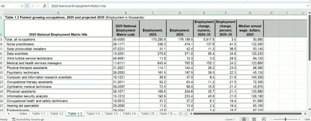

[Slides](https://fmegahed.github.io/isa401/fall2026/class04/04_data_import_export.html) | [Class code](https://github.com/fmegahed/isa401a/blob/main/markdowns/class04.Rmd) | [PDF](index.pdf)

The recording is on Canvas. Timestamps before each paragraph are hh:mm:ss into the recording; drag the player there to hear the passage.


## What we covered

The session opened with three Mentimeter questions about Monday's material, then moved through the two data structures that sit on top of vectors: data frames and lists. Most of the middle of the class was subsetting, which Fadel introduced as the first of the two errors he expects to frustrate you. The last twenty minutes started Part 3, reading a CSV straight from a URL, and set up the Excel example for Wednesday. We did not reach JSON, the Import Heist activity, or Part 4 on export.

The deck's learning objectives for the session:

- **Create and inspect** data frames and lists; run `dplyr::glimpse()` on anything you did not build yourself.
- **Subset and index** those structures with `[ ]`, `[[ ]]`, and `$`.
- **Import** data from CSV files, Excel workbooks, and web-served JSON files.
- **Export** results with `write_csv()` and `write_xlsx()`, then knit and push the lot.

## Warm-up: Monday in three questions

[00:00:01]{.ts} Three questions on Mentimeter. Fadel was explicit that this had no impact on your grade even though Menti calls it a quiz: it was there so he could see where the room was before starting. He also said he had never used Menti for this before and was testing it out.

[00:02:23]{.ts} Question 1 asked which file you should click on before opening RStudio. Eighteen of the votes went to `business_intelligence.Rproj`, which is the answer. The explanation out loud went further than the question: technically you do not have to open the project, but double-clicking the `.Rproj` guarantees that the working directory starts where your folder is, which matters if you open the repo on a different computer. Fadel said he had assumed on Monday that everyone's layout was the M drive, then an ISA 401 folder, then the `business_intelligence` folder, and that it could just as easily be the M drive and then the folder directly. Either way, clicking the project opens RStudio inside `business_intelligence`. The `README.md` has no effect on RStudio at all, and `.gitignore` only tells Git which files and folders not to track, so neither of them starts a session.

[00:05:04]{.ts} Question 2 asked what `crashes_by_day > 2000` returns. The majority of the room picked "just the days above 2,000"; the answer is seven TRUE/FALSE values. Fadel walked through why. `crashes_by_day` is the named vector from Monday, Monday through Sunday, holding the crash counts for each day. The greater-than sign is a logical operator, and applying it to a vector returns TRUE or FALSE for every element: five TRUEs for Monday through Friday, two FALSEs for Saturday and Sunday, which were both under 2,000. He described it as the equivalent of a for loop that walks every element and asks whether the comparison holds. "Just the days above 2,000" is what you get when you put that logical check inside square brackets, `crashes_by_day[crashes_by_day > 2000]`, and use it to subset. That distinction is the whole of Part 2, arriving early.

[00:07:08]{.ts} Question 3 asked what `typeof(c(2020, "Mon"))` gives. Seventeen of twenty-five votes said `"character"`, which is right. Fadel took the chance to answer a question a student had asked him after the previous class: what is a vector? His answer was that you can think of it as a column of data in an Excel table. The difference from Excel is that a column in a spreadsheet lets you mix things, while R and most other programming languages generalise to the most general type that can hold everything in it. Here `2020` on its own is a double and `"Mon"` is a character, and the only way to preserve both is to store the whole thing as text. Same rule as Monday's example: combine integers with doubles and you get doubles.

[00:09:05]{.ts} The Menti leaderboard went up at the end of the warm-up and Fadel congratulated the top scorer. No points this time, but he said there would be points next time.

## Part 1: Data Frames and Lists

[00:09:20]{.ts} Fadel laid out the plan: creating and inspecting data frames, then a lot of subsetting, then importing data inside your markdown. He framed the whole session around two mistakes. His stated goal for the day was that you leave knowing the two common errors that are going to cost you time, and how to address them.

### From vectors to a data frame

[00:10:06]{.ts} The reminder first: a vector is a column of data in an Excel file, and R gives that data structure a specific type. The Lego picture on the slide carries the four common ones. Logical is the grey and yellow tower: the output of something like `crashes_by_day > 2000`, only ever TRUE or FALSE. Categorical is a fixed set of labels, day of the week being Monday through Sunday and nothing else. Numeric is a double or an integer. Character is the open one, where the number of possible values is effectively unlimited.

[00:11:09]{.ts} A vector is one-dimensional, and that is the point of the picture. Because it has only one dimension, pulling something out of it needs only one thing inside the brackets: a single number, or a vector of numbers. Pointing at two grey bricks in the tower and counting from 1, you would ask for `c(2, 3)` and get those two elements back.

[00:12:07]{.ts} Moving from one dimension to a table gives you a data frame. Two ways to build one: `tibble()`, which comes from the tibble package, or `data.frame()`, which anyone who has used R before this class will recognise. A data frame is a collection of vectors, with one hard rule: they all have to be the same length. A vector of length 50 next to a vector of length 100 is an error in R, and an error in Python too, because neither one knows how to line the rows up. Fadel's example of where this bites in practice is web scraping: you scrape two things, they come back at different lengths, and the attempt to put them in a data frame fails. That is a signal that you need a cleaning step before you combine.

[00:13:33]{.ts} Within that rule, each vector can be its own type. Character for the day, doubles for the crashes, logical for busy, all in the same table. That is one of the nice things about data frames, and it is what the `<chr>`, `<dbl>`, `<lgl>` line under the column headers is telling you.

[00:14:00]{.ts} We will not use matrices in this class, but Fadel mentioned them because an AI assistant may well suggest one. A matrix looks like a data frame but can only hold one type, so combining numbers with characters turns the entire matrix to character. He also drew a contrast about named columns, and immediately hedged it with "though some do". There is no matrix slide in the deck; this was said in passing because an AI assistant may suggest one.
<!-- todo: awaiting answer #1 @ 00:14:00 — the matrix/data frame contrast is garbled in the transcript ("a matrix cannot have problems, while a data thing does ... though some do"); confirm what the distinction was -->

[00:14:21]{.ts} Two differences between a tibble and a base data frame, for those who have not used a tibble before. First, it prints better: you get the size, the column names, and the column types before any of the data. Second, extracting a one-by-one element from a data frame gives you a single element, while the same thing on a tibble gives you back a one-by-one tibble.

### Looking at a data frame

[00:14:49]{.ts} The four questions to ask about any data you load: how many rows, how many columns, what are the columns called, and what type is each one. `nrow()` and `ncol()` answer the first two, `colnames()` or `names()` the third. `typeof()` on a data frame is the odd one; it reports `"list"` rather than telling you about any particular column, so to ask about one column you would write something like `crashes_df$day`.

[00:16:07]{.ts} Fadel said he tends to ignore all of those and load dplyr instead. He also explained his own colour scheme while he was there, because it shows up on the slides and in his RStudio: mustard yellow is a package or library name, and the bluish colour is a function name. `glimpse()` gives you the number of rows, the number of columns, the column names, the types, and the first few values in one call. For anyone who has used R before, it is similar to `str()`; it just prints more readably. Both work, and he left the choice to you. He said he thought everyone in this section had used R before, which was not the case in his other section.

### A list holds anything

[00:16:50]{.ts} The third data structure is the list. A list is very flexible, and it is what you usually get back when you pull data from an API. In a data frame every column has to be the same length; in a list nothing has to match. A list can contain another list, a data frame, and vectors of different lengths, all at once. The example on the slide, `example_list`, holds four elements: the integers 1, 2, 3; a single character `"a"`; a logical vector of length 3; and a numeric vector of length 2. That is exactly what we like lists for as a container.

### The pepper shaker

[00:18:20]{.ts} This is where Fadel put the first of the day's two frustrating errors. Subsetting is a fancy way of saying you are extracting information from a structure, and with lists the failure mode is that you think you pulled a vector or a data frame when you actually pulled a list. The mental model on the slide is a pepper shaker. The shaker is the list. Inside it are pepper packets, the elements.

[00:19:03]{.ts} `x[1]` gets you the first packet but leaves it in the container: what comes back is still a list, a list holding the one thing you asked for. `x[[1]]` hands you the packet itself. Go one more level, `x[[1]][[1]]`, and you have the pepper. The rule to hold on to: if you start with a list and use single brackets, you come back with a list.

[00:19:56]{.ts} Why this matters is that functions expect particular inputs. You cannot take a mean of a list, but you can take a mean of a vector. So if the number you want is inside a list, you have to open the container before the function will accept it, which is what `example_list[[1]]` does and `example_list[1]` does not.

### Activity: examine a job ad

[00:20:31]{.ts} At this point we moved to RStudio. Fadel admitted he had not followed his own recommendation from the first Menti question: RStudio had opened on whatever project he used last, rather than from the `.Rproj` file. For you, with one class in this lab, there is only one project to open. He teaches two sections, so he double-clicked the project file for this section and pointed at the top right corner of RStudio, which is where the project name appears.

[00:21:50]{.ts} The markdown for the day was created the same way as Monday: **File → New File → R Markdown**, delete everything after the setup chunk, and fill in the YAML options he showed last class. Fadel asked whether the room could see the slides or wanted him to switch; someone said the side-by-side view of slides and RStudio was better, and after a false start he got the two windows next to each other.

[00:23:45]{.ts} A note on the YAML that came from a student's problem in one of the sections: the indentation was wrong. The fix is to type the colon first and then press Enter before typing the next key. RStudio then indents that line for you, and it keeps indenting the lines that belong at the same level.

The YAML header, as typed:

```yaml
title: 'Class 04: R Data Structures'
author: "Fadel M Megahed"
date: "`r Sys.Date()`"
output:
  html_document:
    toc: true
    toc_float: true
    number_sections: true
    code_folding: show
    code_download: true
```

[00:22:55]{.ts} The file was saved with **File → Save As** into the `markdowns` folder, as `class04.Rmd`. Fadel noted that the deck he had made that morning calls it Class 4, so he stuck with that name.

[00:23:59]{.ts} The activity, two or three minutes on the clock, four expressions to write against the `job` list: extract the company name as "Google" and not as a list; extract the maximum salary as a number; extract the maximum salary again using only square brackets; and get the names of the elements in `job`. His advice while you worked: insert a chunk with the insert button, give the chunk a name such as `activity01`, copy the list definition off the slide rather than retyping it, and run with Ctrl+Enter. Ctrl+Enter works with the cursor anywhere on the line, at the end as well as the beginning.

[00:30:01]{.ts} The debrief. For the company name there are two routes. By position, `job[[2]]`, because company is the second element; you can confirm the position by expanding `job` in the Environment pane. By name, `job$company`. Both return `"Google"` as a value.

[00:31:02]{.ts} The contrast he wanted you to see is what happens with a single bracket. `job[2]` returns a list whose one element is named `company`, and inside that is Google. Assigning `company = job[[2]]` puts a value in your environment; assigning `company_list = job[2]` puts a list of one in your environment. That is the pepper shaker again, and unwrapping it takes another step.

[00:32:41]{.ts} The maximum salary is nested, so it takes two steps: `job$salary$max`. Fadel pointed out the autocomplete while typing: after `job$salary$`, RStudio offers the named things inside, which is only possible because the sublist has names. Salary is a named element of `job`, and `max` is a named element of salary, and that is why the dollar-sign path works.

[00:33:25]{.ts} The all-brackets version of the same path: salary is the third element of `job`, and `max` is the second element inside it, so `job[[3]][[2]]`. He tested each expression in the Console first, saw it return what he expected, and only then wrote it into the chunk. That order is worth copying.

[00:34:05]{.ts} For the names, you can expand `job` in the Environment pane and read them, or call `names(job)`, which returns title, company, and salary.

The class RMD chunk, as it ended up:

```r
#| eval: false
job = list(title   = "Research Data Scientist, Magic Eye",
  company = "Google", salary  = list(min = 147000, max = 210000) )

# 1. The company name.
company = job[[2]] # if you were to use one sq bracket, job[2]   # <1>
company_alt = job$company                                        # <2>

# 2. The maximum salary.
max_salary = job$salary$max                                      # <3>

# 3. The maximum salary again, using only [[ ]].
max_salary_alt = job[[3]][[2]]                                   # <4>

job['salary']$salary$max                                         # <5>

# 4. The names of the elements in job.
names(job)                                                       # <6>
```

1. Company is the second element, and the double bracket opens the container, so this is the string `"Google"`. A single bracket here would have given a list of one instead.
2. The same thing by name.
3. Two steps down: in `job`, take `salary`, then take `max`.
4. The same path written with positions: the third element of `job`, then the second element of that.
5. Starting with a single bracket instead. `job['salary']` is still a list, so you have to name `salary` again to get inside it before `max` is reachable.
6. Title, company, salary.

[00:35:12]{.ts} Fadel rearranged the panes so the whole chunk was visible at once, and mentioned the colouring as a reading aid: with two of something on screen you can see which opening bracket goes with which closing one. He was explicit that this had no effect on the code.

[00:35:51]{.ts} The name for what we had just done: subsetting. You are getting a subset of the data, and you are making sure that subset comes out in the format you need. He returned to the standing rule for the course, that if you show up you should leave understanding every single thing he talked about, and asked twice whether anyone wanted a different explanation.

## Part 2: Subsetting and Indexing

[00:36:40]{.ts} Fadel clicked Knit before moving on, so the HTML would generate in the background, and went back to the deck. The point of Part 2 is that Part 1 used subsetting without explaining it, and only for a list.

### Subsetting a vector

[00:37:11]{.ts} The vector on the slide is real data: unique crashes in Cincinnati in 2025, summed by day of the week, for the whole of last year. Because a vector is one-dimensional, one input inside the brackets is all it takes. `crashes_by_day[2]` returns the second day, Tuesday, and because the vector is named, the name comes back with the value: Tue 2241. You can also index by name, `crashes_by_day["Fri"]`, and get the same kind of result for Friday.

[00:38:34]{.ts} A new section and chunk went into the markdown, and the first thing Fadel did in it was run an experiment rather than state a fact. The question was whether `crashes_by_day$` works. It does not. You cannot use a dollar sign on a vector. He was explicit that this is what the Console is for: when you are not sure, test it.

[00:39:02]{.ts} To pull more than one element you have to hand the brackets a vector. `crashes_by_day[c("Wed", "Fri")]` returns both days by name. `crashes_by_day[c(3, 5)]` returns the same two by position. And when the elements you want sit next to each other, the colon does it: `crashes_by_day[1:5]` gives the first five days.

```r
#| eval: false
crashes_by_day = c(2020, 2241, 2327, 2285, 2380, 1866, 1664)
names(crashes_by_day) = c("Mon", "Tue", "Wed", "Thu",
                          "Fri", "Sat", "Sun")

crashes_by_day[c("Wed","Fri")] # pulling elements by their name   # <1>
crashes_by_day[c(3,5)]                                            # <2>

crashes_by_day[1:5] # : only works for elements in a row [by their index]   # <3>
crashes_by_day[] # returns all the elements --> no diff than crashes_by_day # <4>
```

1. Two elements by name. The quotes are required: without them R reads `Wed` as the name of an object in your environment, and there is no such object.
2. The same two elements by position. Wednesday is the third day, Friday the fifth.
3. The colon only works when the elements are in a row, and it works on positions, not names.
4. Empty brackets return everything, which is no different from typing the object's name.

[00:40:38]{.ts} A reading rule for R that Fadel wanted you to carry: a square bracket means you are extracting data from a data structure, whatever that structure is. Parentheses mean you are applying a function and giving it arguments. Two symbols, two different jobs.

[00:42:22]{.ts} One more difference worth knowing if you did Python in ISA 104: Python starts counting from 0, R starts from 1.

### Subsetting a data frame

[00:43:25]{.ts} A data frame has rows and columns, so the story changes. `crashes_df[["crashes"]]` is the same as `crashes_df$crashes`: both pull a single column out as a vector. Then the two-dimensional form: inside single brackets you give rows, a comma, and columns. Rows can be `1:2` for the first two, `2:3` for rows two and three, a vector such as `c(1, 3)` for rows that are not adjacent, or a logical condition. Columns work the same way, by name or by number, so `c("day", "crashes")` and `1:2` and `c(1, 2)` all get you the first two columns.

### The summary table

[00:45:22]{.ts} The reference slide pulls it together. Single brackets on a vector give a shorter vector; double brackets on a vector exist but are rarely needed, so we skipped them. Single brackets on a list give a shorter list; double brackets give you whatever the element is, a list, a data frame, or a vector. Single brackets on a data frame typically give a smaller data frame; double brackets pull one column as a vector, the same as the dollar sign. And the two prohibitions: no dollar sign on a vector, and the dollar sign only works on a list when the elements have names, which they sometimes do not.

### Activity: predict the output

[00:46:23]{.ts} Two and a half minutes, six expressions across the three objects from today, and the instruction was to predict rather than run. You could copy the code and check, but the point of the short clock was to make you reason from what we had just done.

[00:49:32]{.ts} Working through them. For `crashes_by_day[c(2, 4)]`, Fadel first said Wednesday and Friday and then corrected himself: positions 2 and 4 are Tuesday and Thursday, so those are the two named values that come back. `c(2, 4)` asks for two specific positions, not a range.

[00:50:00]{.ts} `crashes_by_day[Sat]` does not work. Without quotes, `Sat` is read as an object name and there is no object called `Sat`, so you get an object-not-found error.

[00:50:28]{.ts} `sum(crashes_by_day > 2300)` is the Menti question with a function wrapped around it. Inside, the comparison gives seven TRUE/FALSE values, five FALSE and two TRUE. Summing a logical vector counts the TRUEs, because TRUE is 1 and FALSE is 0, so the answer is 2.

[00:51:27]{.ts} `crashes_df$day[crashes_df$crashes < 2000]` has two steps. The dollar sign pulls the `day` column out as a vector, and the condition inside the brackets produces TRUE/FALSE for each element; indexing with that keeps only the TRUE positions. The days under 2,000 crashes are the weekend, so you get Saturday and Sunday.

[00:52:18]{.ts} `crashes_df[["busy"]][3]` is written correctly on both counts, double brackets and the name in quotes. It opens the `busy` column into a logical vector and takes the third element, which is TRUE.

[00:52:43]{.ts} `job["salary"]$max` is the one that catches people, and Fadel flagged that it is deliberately different from what he had typed in the class markdown. The single bracket returns a list, and that outer list does not contain anything called `max`. He said he believed it returned NULL rather than an error but was not certain off the top of his head, so he ran it. It returns NULL.

[00:54:01]{.ts} The autocomplete makes the reason visible. Typing `job["salary"]$` offers only `salary`, because the object at that point is a list of one whose single element is named `salary`. `max` is one level further down, which is why `job["salary"]$salary$max` is what actually reaches it.

## Part 3: Data Import

[00:54:34]{.ts} Three formats for the day: CSV, Excel, and JSON. `read_csv()` reads data that lives on your computer and data that lives on the web, as long as what you point it at is actually a CSV and not, say, a folder containing one. It works the same way as base R's `read.csv()`; Fadel said he prefers the underscore version because it guesses column types. Excel files have to be on your computer. JSON, the semi-structured format from the earlier class, can come from either your computer or the web.

### CSV: Ohio job postings on FRED

[00:55:47]{.ts} The CSV for the day is the Indeed job postings index for Ohio, served by FRED, with roughly five years of data. It is an index rather than a count: February 1, 2020 is set to 100, so a value above 100 means more job postings than there were on that date and a value below 100 means fewer.

[00:56:26]{.ts} Getting the URL was done live, and it is worth repeating because a student asked about it later. Fadel clicked the source link in the slide's footer, which opens the FRED page for the series. On that page there is a **Download** button; the menu under it offers CSV, Excel, an image, and PowerPoint. He right-clicked the CSV entry and copied the link address. That address, quotes and all, is what goes into `read_csv()`.

[00:57:35]{.ts} The install went into the Console, on purpose, because he did not want the installation line sitting in his code. The package is tidyverse, which is a bundle rather than a single package: it brings dplyr, which we had already been using, and readr, which provides `read_csv()`. Note the quotes around `"tidyverse"` in `install.packages()`: tidyverse is not an object in your environment, so it has to be a string. RStudio offered to restart R and Fadel said no, since no packages had been loaded yet in that session.

[00:58:19]{.ts} Then the read itself. Since `read_csv()` was a function we had never used, he pressed **F1** with the cursor on it and read the help page. The arguments that came up: `file`, `col_names` defaulting to TRUE, white space trimmed by default, `skip` defaulting to 0, and the type guessing that looks at a minimum of a thousand rows. The line in the help that matters most for today is the description of `file`, which says it can be a path, a connection, or a URL.

```r
#| eval: false
oh_jobs = readr::read_csv(
  file="https://fred.stlouisfed.org/graph/fredgraph.csv?...&id=IHLIDXUSOH&..."   # <1>
)

oh_jobs_baser= read.csv("https://fred.stlouisfed.org/graph/fredgraph.csv?...")   # <2>

dplyr::glimpse(oh_jobs)                                                          # <3>
dplyr::glimpse(oh_jobs_baser)
```

1. The full URL is very long, so it is abbreviated here; the class RMD has it in full. It is the copied link address, in quotes. Mustard yellow is the package, blue is the function, in Fadel's editor colours.
2. The same URL read with base R's `read.csv()`, so the two can be compared.
3. `glimpse()` on both is the habit, and here it is also the comparison.

[01:00:08]{.ts} Running the `read_csv()` line prints a message rather than staying silent: readr tells you how many rows and columns it read and what types it assigned, and it reports that the date column came back as a date.

[01:00:37]{.ts} The comparison is the reason both lines are there. Both objects have the same number of rows and the same two variables. But `glimpse()` shows that the readr version stored the date column as a date and the value column as a double, while the base R version stored the date column as character. The dashes in the date are why base R leaves it as text. Readr guesses, and that guess is the part Fadel finds helpful.

[01:03:37]{.ts} A live debugging moment, and the lesson generalises. The error was an object-not-found error: the code referred to an object that was not in the Environment. Fadel's two usual suspects for this are that the line creating the object was never run at all, or that Enter was pressed instead of Ctrl+Enter, which types a newline in the editor instead of sending the line to R. This is the error he had flagged the previous class as one of the most frustrating things about R, because the message does not say "you forgot to run line 62"; it just says it cannot find something. The fix was to run the line that creates the object.

[01:05:49]{.ts} Optional, and only if you like the look: the colouring that makes function and library names appear differently is a setting in **Tools → Global Options**. Fadel was briefly unsure whether it lived under Appearance or Code and settled on **Code**, then **Display**, where he had ticked two boxes. He was clear that this is cosmetic and left it up to you.
<!-- todo: which two Display checkboxes were ticked at 01:05:49? The frame is not legible enough to name them -->

### Excel: download first, then read

[01:06:34]{.ts} The next format is Excel, and it starts with an install: the package is readxl. Fadel said the name out loud as "read Excel" and then spelled out that the package itself is `readxl`.

[01:07:15]{.ts} The workbook is on Canvas, under Files: `occupation.xlsx`. Download it rather than trying to read it from a URL.

[01:07:40]{.ts} His strong recommendation is to open the downloaded workbook before you write any code, because Excel data tends to be messy. The messiness has a structural cause: an Excel file can hold multiple sheets, which is why a CSV is called a flat file and a workbook is not. This one has twelve sheets: an index and the numbered tables. The one we want is Table 1.3, and looking at it shows the second problem: the column names are not in the first row. Row 1 is a title written for a human reader, and the header sits in row 2.



[01:07:56]{.ts} Fadel deliberately did not rush this. Reading the workbook properly is Wednesday's work.

## Where we stopped

[01:08:23]{.ts} The plan for Wednesday, as announced: no new slides. We finish importing data, and then use that as the excuse to talk about getting insights out of imported data with AI. Fadel described using a package that lets you ask an OpenAI model questions about the data repeatedly, from inside R.
<!-- todo: awaiting answer #3 @ 01:08:48 — the package name for Wednesday's AI demo did not survive transcription; ellmer? chattr? -->

[01:09:08]{.ts} The end-of-class ritual, unchanged and now with data in it: knit the document, then go to GitHub Desktop, commit, and push. Fadel used `end of class 4` as the commit summary. Committing stores that version; pushing puts it on GitHub, so today's work is available to you in future classes.

[01:09:55]{.ts} He closed by thanking the people who asked questions, and repeated the standing invitation: if you feel he went too fast through something, say so.

We did not get to JSON, the Import Heist activity, or Part 4 on exporting with `write_csv()` and `write_xlsx()`. Those slides are still in the deck if you want to read ahead.

## Questions from class

[00:07:44]{.ts} After the previous class, a student asked what a vector actually is. Fadel answered it at the start of this one: think of it as a column of data in an Excel table, with the difference that a column in R holds exactly one type, and mixing types makes R generalise the whole thing.

[00:21:18]{.ts} Asked whether the room could see the slides or would rather he switched to a side-by-side layout, someone said the side-by-side was better, so that is how the rest of the coding was shown.

[01:01:29]{.ts} A student asked what the package was that had just been installed. It is tidyverse, which contains both dplyr, used for `glimpse()`, and readr, used for `read_csv()`.

[01:02:12]{.ts} A student asked him to walk through how he got the CSV link. He did: click the data-source hyperlink in the slide footer, which opens the FRED series page; click **Download**; right-click the CSV entry and copy the link address. He added that you can also download the file from that page directly. He then compared it with the download button on the embedded chart, thought at first that one might be aggregated by week rather than daily and immediately corrected himself that it may well be the same daily data; the reason he did not use it is that it appeared to be an XLS rather than a CSV.

## Loose ends

<!-- todo: awaiting answer #1 @ 00:14:00 — matrix vs data frame distinction is garbled; confirm the wording -->
<!-- todo: awaiting answer #2 @ 00:55:47 — "Ohio job postings and threats"; the deck settles this ("the Indeed job postings index for Ohio, served by FRED"), so the prose no longer hedges. Question still queued. -->
<!-- todo: awaiting answer #3 @ 01:08:48 — name the AI package promised for Wednesday -->
<!-- todo: awaiting answer #4 @ 00:04:01 — "the cutting theater board" at the Menti transition; confirm "quiz leaderboard" (it is not quoted in the notes, so this only matters if you want it mentioned) -->
<!-- todo: 01:05:49 — name the two Tools > Global Options > Code > Display checkboxes you tick for function/library highlighting, so students can reproduce it -->
<!-- todo: 01:07:40 — you said Table 1.3 would be read properly on Wednesday; confirm the notes should not pre-empt the sheet/skip/n_max arguments here -->
<!-- todo: Part 4 (export) and the Import Heist were not reached on 09/02; say whether they move to Wednesday so the Class 05 notes can pick them up -->